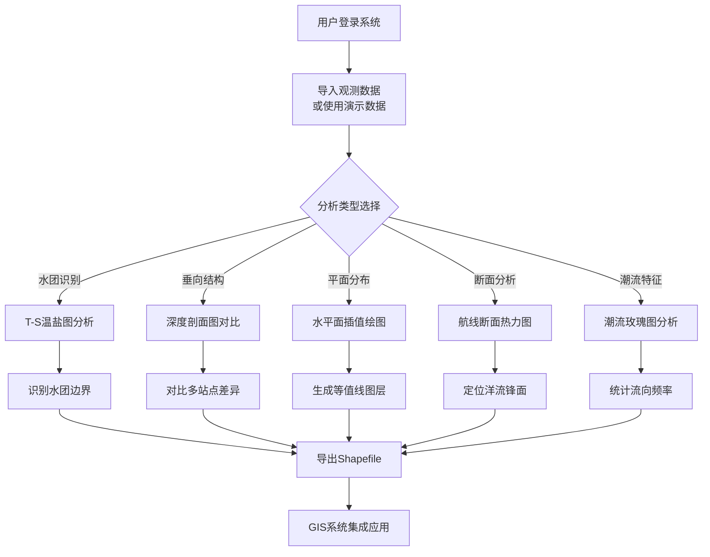

## 1. 产品概述

海洋水文观测数据可视化分析工具是一款面向海洋科研人员、海洋环境监测人员和海洋工程技术人员的专业Web应用。通过集成CTD剖面数据、潮流观测数据的多维可视化分析能力，帮助用户快速识别水团分布、掌握洋流特征、评估海域水文环境，为海洋科学研究和工程决策提供直观的数据支撑。

- 核心价值：将复杂的海洋观测数据转化为直观的可视化图表，降低数据分析门槛，提升科研效率
- 目标用户：海洋科研院所研究人员、海洋环境监测站工作人员、海岸工程设计人员

## 2. 核心功能

### 2.1 功能模块概览

1. **数据导入模块**：支持CSV/JSON格式的CTD剖面数据和潮流时间序列数据导入，内置演示数据集
2. **T-S温盐图模块**：绘制温度-盐度散点图，自动聚类识别不同水团，标注典型水团特征区域
3. **深度剖面图模块**：展示温度、盐度、密度随深度的变化曲线，支持多站点数据叠加对比
4. **水平面分布图模块**：基于Kriging/IDW插值算法生成等温线/等盐线分布图，叠加海图背景展示
5. **断面图模块**：沿规划航线绘制水深断面的温度场分布，通过颜色热力展示洋流特征
6. **潮流分析模块**：展示定点流速流向随时间变化曲线，绘制玫瑰图汇总全月流向频率分布
7. **数据导出模块**：支持分析结果导出为Shapefile格式，便于与ArcGIS/QGIS等GIS系统集成

### 2.2 页面详细设计

| 页面名称 | 模块名称 | 功能描述 |
|-----------|-------------|---------------------|
| 主应用 | 侧边导航栏 | 7个功能模块切换入口，站点列表管理，文件上传入口 |
| T-S温盐图 | 水团识别散点图 | X轴盐度(30-36 PSU)，Y轴温度(0-30°C)，彩色散点按密度着色，K-means聚类标注水团边界 |
| T-S温盐图 | 水团信息面板 | 展示识别出的水团名称、温盐范围、占比统计 |
| 深度剖面 | 参数选择器 | 温度/盐度/密度/声速切换，站点多选复选框 |
| 深度剖面 | 对比曲线图 | 深度倒序Y轴，多站点不同颜色曲线，悬浮tooltip显示数值 |
| 水平面分布 | 图层控制 | 等温线/等盐线切换，插值算法选择(Kriging/IDW)，等值线间距调节 |
| 水平面分布 | 海图叠加展示 | Canvas绘制等值线填色图，叠加模拟海岸线和站点标记 |
| 断面图 | 航线规划 | 可视化选择起终点或多段航线，断面位置预览 |
| 断面图 | 温度场热力图 | 距离-深度二维热力图，等温线叠加，洋流锋面标注 |
| 潮流分析 | 时间序列曲线 | 流速大小曲线+流向箭头时间轴，可按日/周/月切换时间范围 |
| 潮流分析 | 流向玫瑰图 | 16方位风向玫瑰样式，扇区长度=频率，颜色=平均流速 |
| 数据导出 | 导出配置 | 选择导出内容(站点/等值线/水团边界)，坐标系选择，预览属性表 |

## 3. 核心流程

## 4. 用户界面设计

### 4.1 设计风格

- **主色调**：深海蓝 `#0A2463` 为主色，青蓝 `#3E92CC` 为辅助色，珊瑚橙 `#F46036` 为强调色
- **背景色**：深蓝渐变背景 `#051429 → #0A2463`，营造海洋科研氛围
- **卡片风格**：半透明玻璃拟态 `backdrop-blur` + `rgba(255,255,255,0.08)` 边框
- **字体选择**：
  - 标题：'Playfair Display' 衬线字体，学术感强
  - 正文：'Noto Sans SC' + 'Source Code Pro' 数据字体，清晰易读
- **图表配色**：Ocean调色板（蓝→青→绿→黄→橙→红），专业海洋学配色标准
- **按钮风格**：圆角4px，边框+渐变填充，hover时上浮2px+阴影增强

### 4.2 页面设计概览

| 页面名称 | 模块名称 | UI风格描述 |
|-----------|-------------|-------------|
| 主布局 | 侧边栏导航 | 深蓝色固定侧栏，图标+文字导航，激活项青蓝高亮 |
| 主布局 | 顶部工具栏 | 站点下拉选择、插值算法切换、导出按钮组 |
| 主布局 | 主内容区 | 12列栅格，图表卡片占8-12列，控制面板占2-4列 |
| T-S温盐图 | 散点图区 | 全宽高比画布，坐标轴标注学术格式，聚类区域半透明填色 |
| 深度剖面 | 曲线图区 | 深度倒轴，多曲线图例悬浮可点击隐藏/显示 |
| 水平面分布 | 海图区 | Canvas全屏绑图，左上角指北针+比例尺，等值线标签 |
| 断面图 | 热力图区 | 横向长条形热力图，色标图例右侧垂直排列 |
| 潮流分析 | 玫瑰图区 | 中心对称布局，16方位箭头，同心圆频率刻度 |

### 4.3 响应式设计

- Desktop优先(≥1440px)：侧边栏固定(240px)，内容区自适应
- 平板端(768-1439px)：侧边栏可折叠为图标模式(64px)
- 移动端(<768px)：顶部Tab切换，图表单列堆叠，隐藏次要控制面板

### 4.4 交互动效

- 页面加载：图表容器逐帧淡入(staggered 100ms延迟)
- 图表交互：散点/曲线hover放大高亮，tooltip平滑跟随
- 水团聚类：点击聚类区域时边框脉冲动画高亮
- 导出按钮：点击后进度条动画填充，完成后对勾图标弹出
