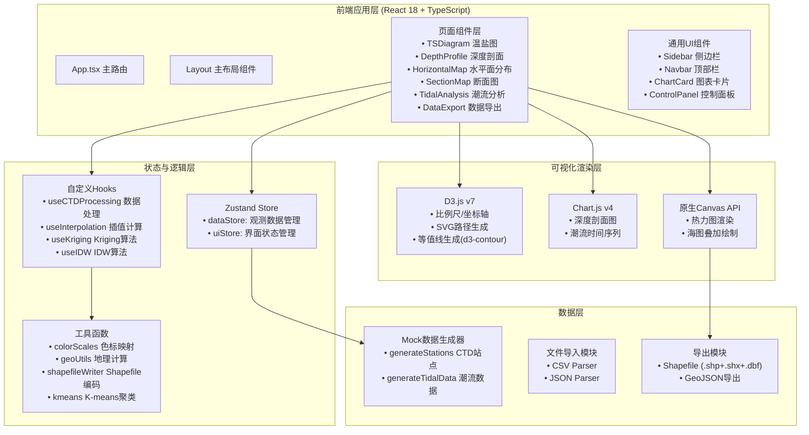

## 1. 架构设计



## 2. 技术栈说明

- **前端框架**：React 18 + TypeScript 5.x + Vite 5.x
- **CSS框架**：TailwindCSS 3.x + 自定义深海蓝主题
- **状态管理**：Zustand 4.x（轻量级Store）
- **图表库**：
  - D3.js v7（复杂可视化：T-S图、等值线、玫瑰图、断面图）
  - Chart.js v4 + react-chartjs-2（标准折线图、柱状图）
- **地理计算**：Turf.js（空间距离计算、插值辅助）
- **文件处理**：PapaParse（CSV解析）、shapefile（Shapefile写入）
- **图标库**：lucide-react
- **后端**：无后端，纯前端应用，内置Mock数据

## 3. 路由定义

| 路由 | 页面组件 | 功能说明 |
|-------|---------|---------|
| `/` | 重定向到 `/ts-diagram` | 默认进入T-S图分析 |
| `/ts-diagram` | TSDiagramPage | T-S温盐图与水团识别 |
| `/depth-profile` | DepthProfilePage | 深度剖面图多站点对比 |
| `/horizontal-map` | HorizontalMapPage | 水平面插值与等值线分布 |
| `/section-map` | SectionMapPage | 航线断面温度场分布 |
| `/tidal-analysis` | TidalAnalysisPage | 潮流时间序列与玫瑰图 |
| `/data-export` | DataExportPage | Shapefile导出配置 |

## 4. 数据模型定义

### 4.1 TypeScript 核心类型

```typescript
// CTD剖面观测数据点
interface CTDDataPoint {
  depth: number;        // 深度(m)
  temperature: number;  // 温度(°C)
  salinity: number;     // 盐度(PSU)
  density: number;      // 密度(kg/m³)
  soundSpeed?: number;  // 声速(m/s)
}

// 观测站点
interface Station {
  id: string;
  name: string;
  longitude: number;    // 经度(°E)
  latitude: number;     // 纬度(°N)
  date: string;         // 观测日期
  maxDepth: number;     // 最大观测深度
  data: CTDDataPoint[]; // 剖面数据
  color: string;        // 展示颜色
}

// 潮流观测记录
interface TidalRecord {
  time: string;         // ISO时间戳
  speed: number;        // 流速(cm/s)
  direction: number;    // 流向(度, 0=北, 90=东)
  uComponent: number;   // U分量(东向, cm/s)
  vComponent: number;   // V分量(北向, cm/s)
  waterLevel?: number;  // 水位(m)
}

// 水团聚类结果
interface WaterMass {
  id: string;
  name: string;         // 水团名称(如:黑潮水团/沿岸水团)
  tempRange: [number, number];
  salRange: [number, number];
  densityRange: [number, number];
  centroid: { temp: number; sal: number };
  pointCount: number;
  color: string;
}

// 水平面插值结果网格
interface InterpolationGrid {
  algorithm: 'kriging' | 'idw';
  parameter: 'temperature' | 'salinity' | 'density';
  depthLevel: number;   // 所选深度层(m)
  xMin: number; xMax: number;  // 经纬度范围
  yMin: number; yMax: number;
  nx: number; ny: number;      // 网格分辨率
  values: number[][];          // 2D数值矩阵
  contours: ContourLine[];     // 等值线
}

// 等值线
interface ContourLine {
  value: number;
  coordinates: [number, number][]; // 经纬度坐标点列
}

// 玫瑰图扇区数据
interface RoseSector {
  direction: number;    // 中心方位角
  directionLabel: string; // N/NE/E/...
  frequency: number;    // 频率(%)
  avgSpeed: number;     // 平均流速(cm/s)
  count: number;        // 记录数
}
```

### 4.2 状态Store (Zustand)

```typescript
// dataStore
interface DataState {
  stations: Station[];
  tidalData: TidalRecord[];
  selectedStationIds: string[];
  activeTab: string;
  // actions
  addStation: (s: Station) => void;
  removeStation: (id: string) => void;
  setSelectedStations: (ids: string[]) => void;
  importCSV: (file: File) => Promise<void>;
  loadDemoData: () => void;
  setActiveTab: (tab: string) => void;
}
```

## 5. 核心算法说明

### 5.1 Kriging插值
- 使用普通克里金(Ordinary Kriging)
- 变异函数模型：球状模型(Spherical Model)
- 实现纯JS版本的半变异函数拟合与权重矩阵求解

### 5.2 IDW插值
- 反距离加权法，默认权重指数 p=2
- 支持可变搜索半径与最多邻近点数限制

### 5.3 等值线生成
- 基于 marching squares 算法
- 使用 d3-contour 库生成 GeoJSON 格式等值线

### 5.4 水团聚类
- K-means聚类算法（纯TS实现）
- 肘部法则自动确定最优聚类数(3-6类)
- 基于温盐特征匹配典型水团命名

### 5.5 Shapefile导出
- 手工编码 .shp(几何), .shx(索引), .dbf(属性) 三文件
- 支持 Point(站点)、Polyline(等值线)、Polygon(水团) 三种类型
- 打包为 .zip 下载

## 6. 项目目录结构

```
src/
├── App.tsx                   # 路由入口
├── main.tsx                  # 应用挂载
├── index.css                 # 全局样式+Tailwind
├── store/
│   ├── dataStore.ts          # Zustand 数据状态
│   └── uiStore.ts            # UI状态
├── types/
│   └── oceanography.ts       # 核心类型定义
├── utils/
│   ├── mockData.ts           # Mock数据生成
│   ├── interpolation/
│   │   ├── kriging.ts        # Kriging算法
│   │   ├── idw.ts            # IDW算法
│   │   └── index.ts
│   ├── clustering/
│   │   └── kmeans.ts         # K-means聚类
│   ├── gis/
│   │   ├── shapefileWriter.ts # Shapefile编码
│   │   └── geoUtils.ts       # 地理计算
│   ├── colorScales.ts        # 海洋色标
│   └── csvParser.ts          # CSV解析
├── hooks/
│   ├── useWaterMass.ts       # 水团识别
│   ├── useContours.ts        # 等值线生成
│   └── useRoseDiagram.ts     # 玫瑰图数据
├── components/
│   ├── layout/
│   │   ├── Sidebar.tsx
│   │   ├── Navbar.tsx
│   │   └── ChartCard.tsx
│   ├── common/
│   │   ├── StationSelector.tsx
│   │   ├── ColorLegend.tsx
│   │   └── DataImporter.tsx
│   ├── ts/
│   │   ├── TSScatterPlot.tsx
│   │   └── WaterMassPanel.tsx
│   ├── depth/
│   │   └── ProfileChart.tsx
│   ├── horizontal/
│   │   ├── InterpolationControls.tsx
│   │   ├── ChartCanvas.tsx
│   │   └── SeaChartOverlay.tsx
│   ├── section/
│   │   ├── RoutePlanner.tsx
│   │   └── SectionHeatmap.tsx
│   ├── tidal/
│   │   ├── TidalTimeSeries.tsx
│   │   └── RoseDiagram.tsx
│   └── export/
│       └── ExportPanel.tsx
└── pages/
    ├── TSDiagramPage.tsx
    ├── DepthProfilePage.tsx
    ├── HorizontalMapPage.tsx
    ├── SectionMapPage.tsx
    ├── TidalAnalysisPage.tsx
    └── DataExportPage.tsx
```
